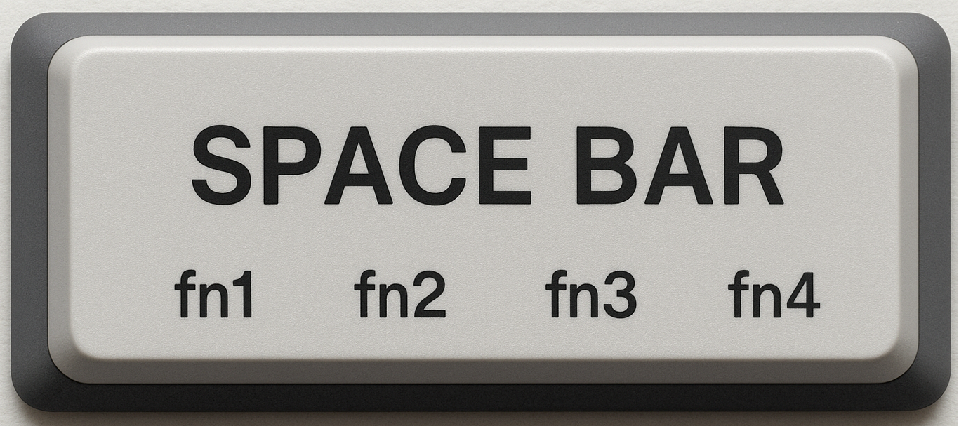
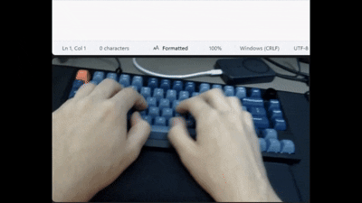
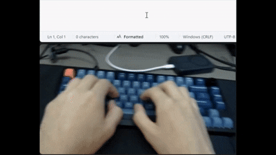

# Sticky Layer Combo Keys

### The thumb cluster stand-in API for 6.25u spacebars

## Contents

1. [Who is this for](#who-is-this-for)

2. [How does it work](#how-does-it-work)

3. [Example and Demo](#example)

4. [Benefit over existing features](#but-what-about-the-existing-qmk-features)

5. [Thought process](#how-did-thumb-clusters-turn-into-this)

6. [How to set it up](#how-do-i-set-it-up)

7. [Quick start code](#quick-start-code)

## Who is this for?
Me (of course!)

Also, this ergo-centered API is for people who want to keep their palms planted on the palm rest for an entire working session while still being able to press any key on the keyboard *quickly*, without having to delegate the easy-to-press keys to becoming full-time `fn` keys.

Like the sub-title suggests, I made this feature while thinking of typists who are fans of using thumb-cluster keys to trigger "sticky" layer changes, but are sticking with traditional keyboard layouts for availability, style, cost etc.

## How does it work?
Simple Example: press Space while Left Control is held to activate a `fn` layer, then release Left Control to pop the `fn` layer when you are done

You will customize key "combos" consisting of 1-4 modifier keys, plus a trigger key to trigger the layer change while the combo keys are being held down. In most cases, the combo will just be 1 sticky key + 1 trigger key.

Once the layer is changed, it will stay active for as long as the mod key designated as the "sticky" key is held. Once the sticky key is released, you will go back to your base layer (which you will designate as part of the API).

## Example
##### Quick Switching between the Numpad Layer and Base Layer, J is "4" on the Numpad layer


In this example I have used the Sticky Combo API to customize a layer change to my first `fn` layer by holding Left Control and tapping Space. I then use the letters above and below j,k,l as a numpad on my right hand while Left Control is held, and releasing Left Control returns me to the base layer. 

Once in the base layer, Control will act normally, unless I press Space while holding it of course

In my example I also performed the HHKB layout swap of remapping Caps Lock to Left Control to further reduce wrist and palm movement. If you like Caps Lock, a similar example would be to use Left Shift instead of Control.

## But what about the existing QMK features?
You could wire similar functionality with something like Tap Dance triggering a custom keycode to toggle a layer change, but to me this would be the equivalent of typing upper-case letters with Caps Lock over Shift (which some people prefer, but I personally don't).

##### Using underscores in an fn layer with a sticky release. "V" is my fn1 underscore key.


## How did thumb-clusters turn into... this?
I say that this is a thumb-cluster replacement because I always configure Space as my trigger key, however you can choose any key on the keyboard to be your trigger key during configuration. You can even use different trigger keys per key combo rule. You must, however, use mod keys as your sticky and extended combo keys.

Essentially, the way I used this feature made it so that the space bar became a "different" thumb key depending on the modifiers that were held down 

The space bar usually has no functionality with mod keys like Control, Shift and Alt which is why I like it as a trigger

## How do I set it up?
[Jump to quick-start code](#quick-start-code)
- Drop the `process_sticky_combo` `.h/.c` files into the same folder as your `keymap.c`. 

- Add `SRC += process_sticky_combo.c` to your `rules.mk` file, and `#include "process_sticky_combo.h"` in your `keymap.c` file.

- Add `process_record_sticky_combo(keycode, record);` to your `process_record_user()` callback.

    - Return `false` when `process_record_sticky_combo()` returns `false` to stop the `trigger`key from registering a key down event event even when it triggers a layer change.

- Finally, you need to define the following four config variables in `keymap.c` at a global scope.

``` C
const sticky_combo_rule_t user_defined_sticky_combos[] = ;
const uint8_t user_defined_sticky_combos_length = ;

const uint8_t user_defined_base_layers[] = ;
const uint8_t user_defined_base_layers_length = ;
```
### Explanation
- `user_defined_sticky_combos` - an array of your sticky combo rules and which layer they trigger, based on the `sticky_combo_rule_t` struct. [Jump to Quick Start Example](#config-example)
``` C
typedef struct {
    uint8_t  layer;
    uint16_t sticky_key;
    uint16_t layer_trigger_button;
    uint16_t optional_extended_combo_key_list[MAX_STICKY_KEY_EXTENDED_COMBO_KEY_COUNT];
    uint8_t  optional_extended_combo_key_list_length;
} sticky_combo_rule_t;
```
- `user_defined_sticky_combos_length` - how many sticky combos you have defined
- `user_defined_base_layers` - Useful for keyboards with Mac and Windows toggles. Most people will probably only have 1 base layer to register here.
    - On `fn` layer unset, you will return to the most recently visited base layer, which is checked constantly.
- `user_defined_base_layers_length` - how many base layers you have defined

## Quick Start Code
See all the integration code together in one commit here: [Github link](https://github.com/NormanJP/share_qmk_sticky_combo_API/commit/c6d48e9267b8699b79cb81f30b9e8971878d6f97)

### Include example
`keymap.c` (after adding `process_sticky_combo` `.h/.c` to same folder)
``` C
#include "process_sticky_combo.h"
...
bool process_record_user(uint16_t keycode, keyrecord_t *record) {
    const bool sticky_combo_result = process_record_sticky_combo(keycode, record);
    return sticky_combo_result;
}
```
`rules.mk`
```
SRC += process_sticky_combo.c
```
### Config Example
`keymap.c`
``` C
const sticky_combo_rule_t user_defined_sticky_combos[] = { 
    { EXTRA_LAYER_2, KC_LCTL, KC_SPC, { KC_LALT }, 1 }, 
    { EXTRA_LAYER_1, KC_LCTL, KC_SPC, { }, 0 } // the config of gif #1
};
const uint8_t user_defined_sticky_combos_length = 2;

const uint8_t user_defined_base_layers[] = { WIN_BASE, MAC_BASE };
const uint8_t user_defined_base_layers_length = 2;
```

- And that's it

#### Pro-tips
- If a sticky key is being used in multiple layers, the one with the most
extended combo keys should be listed first, to avoid short circuiting (like I did with `KC_LCTL` in my `EXTRA_LAYER_2` rules being listed before my `EXTRA_LAYER_1` rule which contains no extra mod keys).
    
    The feature will check the user-defined rules in-order
- You can designate any key which is tracked by the `MOD_BIT()` function as a `sticky_key` or `optional_extended_combo_key_list` key. Examples: `KC_LCTL`, `KC_LSFT`, `KC_LALT`, `KC_RCTL`, `KC_RSFT`, `KC_RALT`

## Do you like this feature?
If so, please tell me on whatever platform I shared it with you :)

If enough people enjoy it then I'll organize this into a PR to the public QMK repo

## Gallery
##### Swapping between three layers on the fly - Numpad / Mousekeys / Arrow Keys


##### Yet Another Numpad demo
